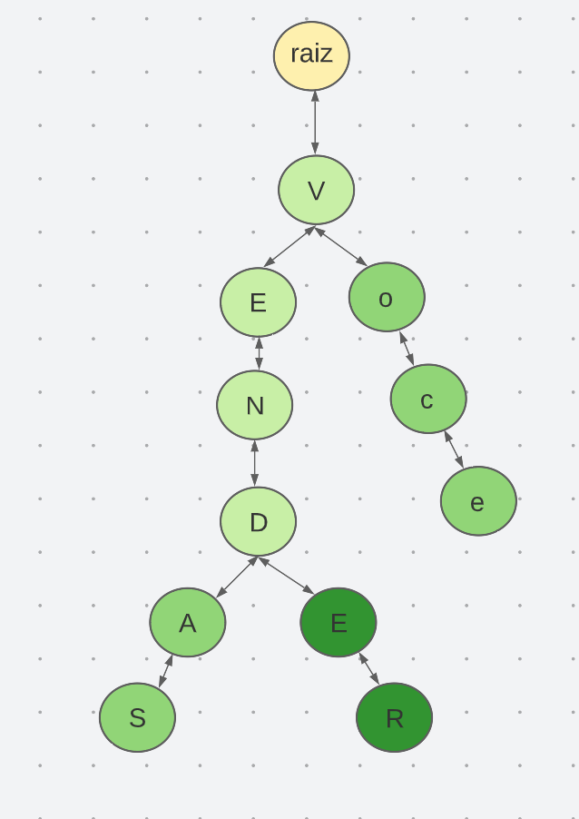

# Árvores de prefixo / Tries

Do inglês `Trie`, uma `árvore de prefixos`, ou também uma `árvore digital`, é uma estrutura de dados usada para implementar [`Tabelas de Símbolos`](https://pt.wikipedia.org/wiki/Tabela_de_s%C3%ADmbolos) de strings. Muito útil para `buscas` de sequências de caracteres por prefixos, como nomes de pessoas, palavras de um livro e DNA.

É ainda conhecida como `R-way trie` `(RT)`, cada nó pode ter `R` filhos. Onde o alfabeto das chaves tem R caracteres e que R = 256 (às vezes só 26, mas não 65536).

## Tabela de Símbolos de string


Os caracteres das chaves podem ser examinados um a um. Coisa que não faz sentido com chaves de tipo genérico

Cada chave tem um comprimento (número de caracteres).


O alfabeto (conjunto de caracteres) das chaves é conhecido a priori.


O desempenho de uma Tabela de Símbolos de strings é medido em termos de número `N` de chaves, comprimento máximo `W` das chaves, comprimento médio `w` das chaves e tamanho `R` do alfabeto.

Em muitas aplicações, o tempo de get(key) não depende de N mas é proporcional ao comprimento de key no caso de busca bem-sucedida essencialmente constante em busca malsucedida (porque nem chega a examinar todos os caracteres da chave).

## O conceito de árvore

Conceitualmente, uma árvore é composta por uma cadeia de ramos originados em sua raiz.

A raiz é o primeiro nó na cadeia de ramos.

Cada ramo é composto com por um conjunto de nós que podem originar novas cadeias de ramos ou não.

## A Árvore de prefixos

Prefixos são strings que podem resultar em diferentes palavras / chaves.

Em uma `árvore de prefixos`, os ramos são prefixos que podem compor múltiplas chaves. As chaves são armazenadas como uma sequência de caracteres, ou sequência de nós, em forma de lista duplamente ligada.

O primeiro caractere da chave é um nó filho da raiz da árvore. Os caracteres sucessores são nós filhos de seus antecessessores, respectivamente.

O último caractere da palavra é conhecido como sendo o `nó terminal` de uma chave.

Dito isto, palavras que compartilham o mesmo prefixo, compartilham o mesmo ramo na árvore.



A string `v` está representada na árvore mas não é uma chave. `vendas`,  `vender` e `você` são chaves que compartilham o mesmo prefixo.

A string `vend` está representada na árvore mas não é uma chave. `vendas` e `vender` são chaves que compartilham o mesmo prefixo.

## Exemplo de implementação

```typescript
// Nó
class No { 
  public valor: string | null;
  public pai: No | null;
  public ramos: Map<string, No>;
  public terminal: boolean;

  constructor(valor: string | null) {
    this.valor = valor;
    this.pai = null;
    this.ramos = new Map();
    this.terminal = false;
  }

  public pegarPalavra() {
    let palavra = [];
    let no: No | null = this;

    while (no !== null) {
      palavra.unshift(no.valor);
      no = no.pai ? no.pai : null;
    }

    return palavra.join('');
  };
};

export class ArvoredePrefixos {
  public raiz: No;

  constructor () {
    this.raiz = new No(null)
  }

  // adicionar nova palavra na árvore
  public adicionar(palavra: string): void {
    // aponta ponteiro para o nó na raiz da árvore
    let no = this.raiz;
    // para cada posicao da palavra
    for (let posicao = 0; posicao < palavra.length; posicao++) {
      const caractere = palavra[posicao];
      // caso o nó atual não possua um nó filho com a caractere atual
      if(!no.ramos.has(caractere)) {
        //    criar um novo nó tendo o seu pai dado a raiz atual
        const novoNo = new No(caractere);
        // o pai do novo nó é a raiz atual
        novoNo.pai = no;
        // adiciona o novo nó como filho da raiz atual
        no.ramos.set(caractere, novoNo);
      }
      // ponteiro para o próximo nó, que é o caractere filho da raíz atual
      no = no.ramos.get(caractere) as unknown as No;
      // se a posicao atual for a ultima posicao da palavra
      if (posicao === palavra.length - 1) {
        // definir o nó como terminal no ramo
        no.terminal = true;
      }
    }
  }
  
  // checar se a árvore contem a palavra dada.
  public busca (palavra: string) {
    // ponteiro para o nó na raiz da árvore
    let no = this.raiz;
    // para cada posicao da palavra
    for (let posicao = 0; posicao < palavra.length; posicao++) {
      const caractere = palavra[posicao];
      // caso o nó atual possua um nó filho com a caractere atual
      const filho = no.ramos.get(caractere);
      if(filho) {
        //  apontar ponteiro no para o no filho
        no = filho;
      } else {
        // não contém
        return false;
      }
    }
    return no.terminal;
  }

  // buscar chaves dado um prefixo
  public chavesComOPrefixo (prefixo: string = ''): string[] {
    if (prefixo === '') {
      return [];
    }
    let no = this.raiz;
    const nos: No[] = [];
    // para cada caractere do prefixo com comprimento X, 
    for(let posicao = 0; posicao < prefixo.length; posicao++) {
      // encontrar o último nó em sua sub-árvore
      const caractere = prefixo[posicao];
      const filho = no.ramos.get(caractere);
      if (filho) {
        no = filho;
      } else {
        return [];
      }
    }
    // palavras encontradas, inicialmente vazia pois só 
    // encontramos uma sub-ávore até o momento
    const palavras: string[] = [];
    // pegar todas as palavras dada uma sub-árvore
    this.pegaPalavas(no, palavras);
    return palavras;
  }

  // pega palavra em uma sub-árvore
  private pegaPalavas (no: No, palavras: string[]): void {
    // se o nó atual for o terminal nó de uma chave
    if (no.terminal) {
      palavras.push(no.pegarPalavra())
    }
    // itera sobre todas as sub-árvores
    for(let noFilho of no.ramos.values()) {
      this.pegaPalavas(noFilho, palavras);
    }
  }

  public chavesComOCoringa (prefixo: string): string[] {
    if (prefixo === '') {
      return [];
    }
    let no = this.raiz;
    const nos: No[] = [];
    // para cada caractere do prefixo com comprimento X, 
    for(let posicao = 0; posicao < prefixo.length; posicao++) {
      // encontrar o último nó em sua sub-árvore
      const caractere = prefixo[posicao];
      const filho = no.ramos.get(caractere);
      if (filho) {
        no = filho;
      } else {
        return [];
      }
    }
    // palavras encontradas, inicialmente vazia pois só 
    // encontramos uma sub-ávore até o momento
    const palavras: string[] = [];
    // pegar todas as palavras dada uma sub-árvore
    this.pegaPalavas(no, palavras);
    return palavras;
  }

  
  // remove uma palavra da árvore
  public remover (palavra: string): void {
    // pega o primeiro nó do ramo, nesse caso a raiz
    let no = this.raiz;

    if (!palavra) {
      return
    }

    this.removerChave(no, palavra);
  }

  // encontrar e remover palavra recursivamente
  private removerChave (no: No, palavra: string): boolean  {
    // checa se o nó atual contem a palavra
    if (no.terminal && no.pegarPalavra() === palavra) {
      let temRamos = no.ramos.size > 0;

      // se o nó conter ramos, então marcar o nó terminal como falso,
      // dessa forma não removemos chaves que contém/inclui a palavra dada.
      if (temRamos) {
        no.terminal = false;
      } else {
        if(no.pai) no.pai.ramos = new Map<string, No>();
      }

      return true;
    }

    // remover palavras de todos os ramos recursivamente
    for(let noFilho of no.ramos.values()) {
      this.removerChave(noFilho, palavra);
    }

    return false;
  }
}

```


## Uso

```typescript
const arvore = new ArvoredePrefixos();

arvore.adicionar('vendas');
arvore.adicionar('vender');
arvore.adicionar('vendido');
arvore.adicionar('você');


const palavrasEncontradas = arvore.chavesComOPrefixo('v');
console.log(palavrasEncontradas.length) // 44
console.log(palavrasEncontradas[0]) // vendas
console.log(palavrasEncontradas[1]) // vender
```