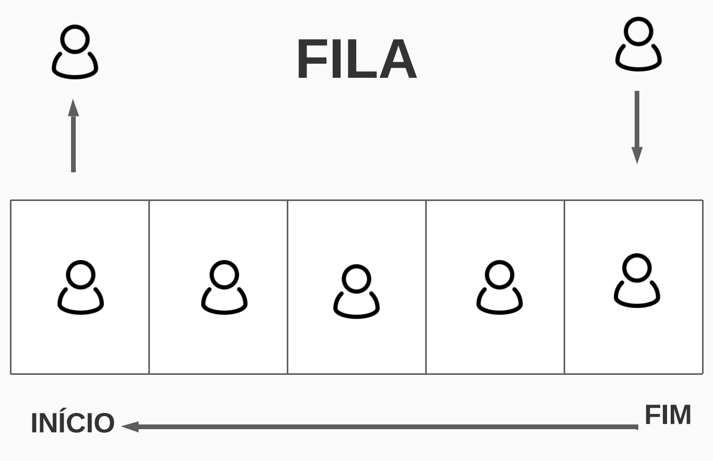

# Filas - Queues

Filas são estruturas de dados que suportam operações de `adição (enfileirar)` e `remoção (desenfileirar)` de elementos e obrigatoriamente deve implementar as seguintes regras:  

1. O acesso á estrutura é restrito ao elemento mais antigo
2. Na remoção, o elemento removido é o que está na estrutura há mais tempo. Ou seja, o elemento removido é que se encontra no começo da fila.

Dessa forma, podemos dizer que o `primeiro objeto a ser inserido na fila é também o primeiro a ser removido`.

Esse padrão é conhecido pela sigla `FIFO`, que significa `First-In-First-Out`.

A implementação mais comum de uma `fila` é feita com `vetores circulares`. Alternativamente, uma fila pode ser implementadas usando uma estrutura de `Lista Ligada`, composta por nós interligados.



### Complexidade de tempo e espaço - Big O

Independentemente do tamanho N da fila, numa fila ideal utilizando vetores, operações básicas devem ocorrer em `O(1)` - `tempo constante` considerando a memória já alocada.  A complexidade será O(n) quando a memória alocada for excedida em operações de inserção.

#### Fila.enfileirar

`Complexidade de tempo`: O(1)

`Complexidade de espaço`: O(1)

#### Fila.desenfileirar

`Complexidade de tempo`: O(1)

`Complexidade de espaço`: O(1)


#### Pilha.primeiroDaFila

`Complexidade de tempo`: O(1)

`Complexidade de espaço`: O(1)

## Implementação de uma Fila usando a linguagem Typescript.

Caso a fila esteja `vazia` e haja a tentativa de um `desenfileiramento` deve ocorrer um `Erro`.

  ***`Tipo da fila`***
  
  Apesar do tipo de dados dos elementos do vetor ser irrelevante, a implementação á seguir 
  associa um tipo de dado específico aos ítems do vetor.

## Implementação em um vetor

Suponha que nossa fila está armazenada em um vetor, o tamanho é `N`, onde `N` é o número de elementos na fila.

        fila[0..N]

O tipo de dados dos elementos do vetor é irrelevante.

Digamos que a parte do vetor ocupada pela fila é:

        fila[C..F]

O índice `C` indica a primeira posição ocupada do vetor, em outras palavras, o index que represeta o primeiro item da fila. E `F` é o índice na posição final da fila.

A fila está `vazia` se `F vale 0` e `cheia` se `F vale N-1`. Uma fila vazia poderia ser desenhada da seguinte forma.

<table class="myarray" border="1" style="size: 400px; color: #ffffff;">
<tbody><tr class="indices">
   <td><kbd>(-1) C</kbd> / <kbd>N-1</kbd>
   </td><td><kbd>(0) F</kbd>
   </td><td><kbd>(1)</kbd>
   </td><td><kbd>(2)</kbd>
   </td><td><kbd>(3)</kbd>
   </td><td><kbd>(4)</kbd>
   </td><td><kbd>(5)</kbd>
   </td><td>
</td></tr><tr class="boxes" style="background-color: #333; color: #ffffff;">
   <td class="mag">
   </td><td class="mag">
   </td><td class="mag">
   </td><td class="gry">&nbsp;
   </td><td class="gry">&nbsp;
   </td><td class="gry">&nbsp;
   </td><td class="gry">&nbsp;
</td></tr></tbody></table>


Ao enfileirar o nome José numa fila vazia, teríamos:

<table class="myarray" border="1" style="size: 400px; color: #ffffff;">
<tbody><tr class="indices">
   <td><kbd>(0) C</kbd> / <kbd>N-1</kbd>
   </td><td><kbd>(1) F</kbd>
   </td><td><kbd>(2)</kbd>
   </td><td><kbd>(3)</kbd>
   </td><td><kbd>(4)</kbd>
   </td><td><kbd>(5)</kbd>
   </td><td>
   </td><td>
</td></tr><tr class="boxes" style="background-color: #333; color: #ffffff;">
   <td class="mag">José
   </td><td class="mag">
   </td><td class="gry">
   </td><td class="gry">
   </td><td class="gry">
   </td><td class="gry">
   </td><td class="gry">&nbsp;
</td></tr></tbody></table>


Ao enfileirar os nomes João e Jesus, nessa mesma ordem, teríamos:

<table class="myarray" border="1" style="size: 400px; color: #ffffff;">
<tbody><tr class="indices">
   <td><kbd>(0) C</kbd>
   </td><td><kbd>(1)</kbd>
   </td><td><kbd>(2) N-1</kbd>
   </td><td><kbd>(3) F</kbd> /
   </td><td><kbd>(4)</kbd>
   </td><td><kbd>(5)</kbd>
   </td><td><kbd>(6)</kbd>
   </td><td>
   </td></tr><tr class="boxes" style="background-color: #333; color: #ffffff;">
   <td class="mag">José
   </td><td class="mag">João
   </td><td class="gry">Jesus
   </td><td class="gry">
   </td><td class="gry">
   </td><td class="gry">
   </td><td class="gry">
   </td></tr></tbody></table>


Ao desenfileirar, teríamos:

<table class="myarray" border="1" style="size: 400px; color: #ffffff;">
<tbody><tr class="indices">
   <td><kbd>(0)</kbd>
   </td><td><kbd>(1) C</kbd>
   </td><td><kbd>(2) N-1</kbd>
   </td><td><kbd>(3) F</kbd>
   </td><td>
   </td><td>
   </td><td>
   </td><td>
   </td></tr><tr class="boxes" style="background-color: #333; color: #ffffff;">
   <td class="mag"><kbd>indefinido</kbd>
   </td><td class="mag">João
   </td><td class="gry">Jesus
   </td><td class="gry">
   </td><td class="gry">
   </td><td class="gry">
   </td><td class="gry">
   </td></tr></tbody></table>


```typescript
export class FilaVetor<T> {
  /**
   * Vetor para armazenamento dos dados
   */
  private fila: Array<T | undefined>;

  /**
   * controla o final da fila
   */
  private indexFinalDaFila: number;
  
  /**
   * controla o começo da fila
   */
  private indexComecoDaFila: number;

  /**
   * controla o tamanho da fila
   */
  private _tamanho: number;

  constructor({ valores }: { valores?: T[] }) {
    /**
     * inicia a estrutura da Fila
     */
    this._tamanho = 0;
    this.fila = [];
    
    this.indexComecoDaFila = 0;
    this.indexFinalDaFila = -1;
    
    // adiciona valores inicias da fila
    if (valores && valores?.length > 0) {
      for (let x = 0; x < valores.length; x++) {
        const valor = valores[x];
        this.enfileirar(valor);
      }
    }
  }

  /**
   * enfileirar item, colocar no final da fila
   */
  enfileirar(valor: T): void {
    // controla o final da fila que agora possui mais um elemento
    this.indexFinalDaFila += 1;
    // adiciona o elemento no final da fila
    this.fila[this.indexFinalDaFila] = valor;
    // incrementa o tamanho da fila
    this._tamanho += 1;
  }

  /**
   * desenfileirar item, tirar do começo da fila
   */
  desenfileirar(): T | undefined {
    /**
     * tenta capturar o primeiro item na fila, Erro se fila está vazia
     */
    const item = this.primeiroDaFila;
    /**
     * Ao inves de deletar a entrada na fila, setar seu valor como indefinido
     */
    this.fila[this.indexComecoDaFila] = undefined;
    /**
     * incrementa o comeco da fila
     */
    this.indexComecoDaFila += 1;
    /**
     * Diminui o tamanho da fila
     */
    this._tamanho -= 1;
    /**
     * Retorn item desenfileirado
     */
    return item;
  }

  /**
   * capturar o primeiro item da fila
   */
  get primeiroDaFila(): T | undefined {
    /**
     * fila não pode estar fazia
     */
    if (this._tamanho === 0) {
      throw new Error('Fila vazia');
    }
    /**
     * pega o item no comeco da fila
     */
    return this.fila[this.indexComecoDaFila];
  }

  /**
   * esvaziar a fila
   */
  limpar() {
    this.fila = [];
    this.indexFinalDaFila = 0;
    this.indexComecoDaFila = -1
    this._tamanho = 0;
  }

  /**
   * retorna tamanho da fila
   */
  get tamanho(): number {
    return this._tamanho;
  }

  /**
   * checa se fila está vazia
   */
  get estaVazia(): boolean {
    return this._tamanho === 0;
  }
}
```

## Implementação em uma Lista Ligada

```typescript
/**
 * O nó representa um item na fila contendo um valor e uma ligação para o póximo item na fila
 */
class No<T> {
  public valor: T;
  public proximo: No<T> | null;
  constructor(valor: T) {
    this.valor = valor;
    this.proximo = null;
  }
}

export class FilaLigada<T> implements IFila<T> {
  /**
   * ponteiro para o primeiro item da fila
   */
  private primeiro: No<T> | null;
  
  /**
   * ponteiro para o último item da fila
   */
  private ultimo: No<T> | null;
  
  /**
   * controla o _tamanho da fila
   */
  private _tamanho: number;
  
  constructor({ valores }: { valores?: T[] }) {
    /**
     * inicia a estrutura da fila
     */
    this.primeiro = null;
    this.ultimo = null;
    this._tamanho = 0;

    /**
     * adiciona valores inicias da fila
     */
    if (valores && valores?.length > 0) {
      for (let x = 0; x < valores.length; x++) {
        const valor = valores[x];
        this.enfileirar(valor);
      }
    }
  }
  
  /**
   * enfileirar item, colocar no final da fila
   */
  public enfileirar(valor: T): void {
    /**
     * criar no referente ao novo item na fila
     */
    let no = new No(valor);
    /**
     * Se houver itens na fila
     */
    if(this._tamanho > 0)
    {
      /**
       * Pega o ultimo item da fila atualmente
       */
      let ultimoEnfileirado = this.ultimo;
      if (ultimoEnfileirado) {
        /**
         * Liga o novo nó que está entrando na fila ao último atual.
         */
        ultimoEnfileirado.proximo = no;
      }
      /**
       * atualiza o ponteiro que aponta para diretamente para o último item da fila
       */
      this.ultimo = no
    } else {
      /** 
       * se não houver itens na lista, o novo nó que está entrando 
       * na lista será apontado para início e o final da fila respectivamente
       */
      this.ultimo = no;
      this.primeiro = this.ultimo;
    }
    // aumenta o _tamanho da fila
    this._tamanho++;
  }
  
  /**
   * desenfileirar item, tirar do começo da fila
   */
  public desenfileirar(): T | undefined {
    // caso haja itens enfileirados
    if(this._tamanho > 0) {
      // recupera o valor do primeiro item na fila
      const valor = this.primeiro?.valor;
      // definir o proximo da fila como o proximo do primeiro atual da fila
      let proximoDaFila = this.primeiro ? this.primeiro.proximo : null;
      // define primeiro da fila como sendo o item recuperado anteriormente
      this.primeiro =  proximoDaFila;
      // diminui o _tamanho da fila
      this._tamanho--;
      // retorn o valor do primeiro item na fila
      return valor;
    } else {
      // caso não haja itens enfileirados
      this.ultimo = this.primeiro;
      throw new Error('Fila vazia');
    }
  }
  
  /**
  * capturar o primeiro item da fila
  */
  public get primeiroDaFila(): T | undefined {
    /**
    * fila não pode estar fazia
    */
    if (this._tamanho === 0) {
      throw new Error('Fila vazia');
    }
    /**
    * pega o item no comeco da fila
    */
    return this.primeiro?.valor
  }
  
  /**
   * esvaziar a fila
   */
  public limpar (): void {
    this.primeiro = null;
    this.ultimo = null;
    this._tamanho = 0;
  }

  /**
   * retorna tamanho da fila
   */
  public get tamanho(): number {
    return this._tamanho;
  }
  
  /**
   * checa se fila está vazia
   */
  public get estaVazia (): boolean {
    return this._tamanho > 0 ? false : true;
  }
}
```

## Uso

```typescript
const max_items = 500000;
const valores = ['José', 'João', 'Jesus'];

const fila = new FilaVetor<string>({ valores }); // ou new FilaLigada({ valores })
while (fila.tamanho <= max_items) {
  fila.enfileirar(`James ${fila.tamanho}`);
}

```

### Benchmark

`Hardware`

Mac Mini 

Processor: 3 GHz 6-Core Intel Core i5

Memory: 32 GB 2667 MHz DDR4

`Requerimento`

Considerando a idéia de `Fila usando um Vetor`, `Fila usando um Map` e `Fila usando uma Lista Ligada` citada anteriormente. Veja a seguir o benchmark para cada tipo de implementação:

O programa deverá criar uma Fila contendo os itens 'José', 'João', 'Jesus'.

Após a fila ser criada, o programa deverá empilhar novos itens até atingir 500.000 itens.

```typescript
const max_items = 500000;
const valores = ['José', 'João', 'Jesus'];

const fila = new FilaVetor<string>({ valores }); 
while (fila.tamanho <= max_items) {
  fila.enfileirar(`James ${fila.tamanho}`);
}
```

#### Resultados

- `Fila usando um Vetor` - 500.000 itens

      $ ts-node ts-node ./src/Filas/benchmark/FilaVetor.ts
      Tempo de execução: 77.337266 ms
      consumo aproximado: 127.77216339111328 MB

- `Fila usando um Map` - 500.000 itens

      $ ts-node ts-node ./src/Filas/benchmark/FilaMap.ts
      Tempo de execução: 165.776193 ms
      consumo aproximado: 147.30326080322266 MB

- `Fila usando Lista Ligada` - 500.000 itens

      $ ts-node ts-node ./src/Filas/benchmark/FilaLigada.ts
      Tempo de execução: 115.32131898403168 ms
      consumo aproximado: 135.43413543701172 MB

## Repositório

O código completo poderá ser encontrado em [https://github.com/web2solutions/ds-ts/tree/main/src/Filas](https://github.com/web2solutions/ds-ts/tree/main/src/Filas).

Todos os arquivos para download: [https://github.com/web2solutions/ds-ts/raw/main/src/Filas.zip](https://github.com/web2solutions/ds-ts/raw/main/src/Filas.zip)
