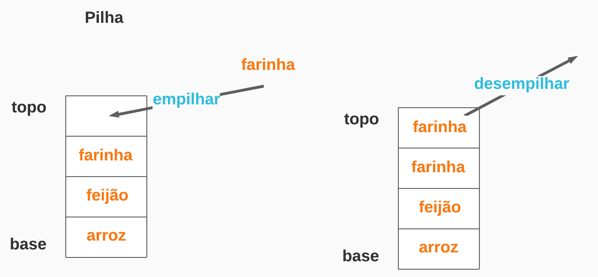

# Pilhas - Stacks

Pilhas são estruturas de dados que suportam operações de adição e remoção de elementos e obrigatoriamente deve implementar as seguintes regras:  

1. A adição de novos elementos é feita no topo da estrutura.
2. Na remoção, o elemento removido é o que está na estrutura há menos tempo. Ou seja, o elemento removido é que se encontra no topo.

Dessa forma, podemos dizer que o primeiro objeto a ser inserido na pilha é o último a ser removido. 

Esse padrão é conhecido pela sigla `LIFO`, que significa `Last-In-First-Out`.



## Implementação em um vetor

Suponha que nossa pilha está armazenada em um vetor, onde `N` é o capacidade ou comprimento máximo da pilha:

        pilha[0..N-1]

O tipo de dados dos elementos do vetor é irrelevante.

Digamos que a parte do vetor ocupada pela pilha é:

        pilha[0..t-1]

O índice `t` indica a primeira posição vaga do vetor e `t-1` é o índice do topo da pilha.

A pilha está `vazia` se `t vale 0` e `cheia` se `t vale N`.

No exemplo da figura, os caracteres A, B, … , H foram inseridos na pilha nessa ordem:

<table class="myarray" border="1" style="size: 400px;">
<tbody><tr class="indices">
   <td><kbd>0</kbd>
   </td><td>&nbsp;
   </td><td>&nbsp;
   </td><td>&nbsp;
   </td><td>&nbsp;
   </td><td>&nbsp;
   </td><td>&nbsp;
   </td><td>&nbsp;
   </td><td><kbd>t</kbd>
   </td><td>&nbsp;
   </td><td>&nbsp;
   </td><td><kbd>N-1</kbd>
</td></tr><tr class="boxes" style="background-color: #333;">
   <td class="mag">A
   </td><td class="mag">B
   </td><td class="mag">C
   </td><td class="mag">D
   </td><td class="mag">E
   </td><td class="mag">F
   </td><td class="mag">G
   </td><td class="mag">H
   </td><td class="gry">&nbsp;
   </td><td class="gry">&nbsp;
   </td><td class="gry">&nbsp;
   </td><td class="gry">&nbsp;
</td></tr></tbody></table>


Conceitualmente, para desempilhar (remover - pop) um elemento da pilha, faça: 

```C
    t -= 1;
    x = pilha[t];
```

Não é possível desempilhar em uma pilha vazia.

Conceitualmente, para empilhar (inserir - push) um ítem y na pilha, faça:


```C
    pilha[t] = y; 
    t += 1;
```

Caso a pilha esteja `cheia` e haja a tentativa de um `empilhamento` deve ocorrer um `transbordamento`. Do inglês: `overflow`, ou, `stack oveflow`.

## Implementação

    Apesar do tipo de dados dos elementos do vetor ser irrelevante, a implementação á seguir 
    associa um tipo aos dados do vetor.

```typescript
export class Pilha <T> {
  /** 
   * vetor para armazenar os dados da pilha
   */
  private pilha: Array<T> = [];
  
  /**
   * em Typescript/Javascript não há arrays com dimensão fixa.
   * essa proriedade será usada para emular a capacidade máxima 
   * de armazenamento da pilha.
   */
  private _capacidade: number;
  
  /**
   * O construtor da pilha suportará um objeto como parâmetro, contendo 2 atributos opcionais:
   *    capacidade: define a capacidade máxima de armazenamento da pilha. Padrão: 10
   *    valores: elementos que serão inseridos ao criar a pilha. Padrão: nenhum
   */
  constructor(
    { capacidade, valores }: { capacidade?: number, valores?: T[] }
  )
  {
    this._capacidade = capacidade ? capacidade : 10;
    if (valores) {
      for (let x = 0; x < (valores?.length || 0); x++) {
        const valor = valores[x];
        this.empilhar(valor);
      }
    }
  }
  
  // empilhar item no topo da pilha
  public empilhar(valor: T): Array<T> {
    if (this.tamanho === this.capacidade) {
      throw new Error('Pilha transbordada - Stack overflow')
    }
    this.pilha.push(valor);
    return this.pilha;
  }
  
  // tirar o último ítem da lista
  public desempilhar (): T {
    if (!(this.pilha.length > 0)) {
      throw new Error('Pilha vazia');
    }
    return this.pilha.pop() as unknown as T;
  }
  
  // checa se pilha está vazia
  public get estaVazia (): boolean {
    return !!(this.pilha.length === 0);
  }
  
  // recupera o ítem na base da pilha
  public get base () {
    return this.pilha[0];
  }
  
  // recupera o ítem no topo da pilha
  public get itemNoTopo () {
    return this.pilha[this.topo];
  }

  // recupera o index do topo
  public get topo () {
    return this.pilha.length - 1;
  }
  
  // retorna o tamanho da pilha
  public get tamanho() { 
    return this.pilha.length;
  }

  public get capacidade() { 
    return this._capacidade;
  }
}
```

## Uso

```typescript
const valores = ['arroz', 'feijão', 'farinha'];
const pilha = new Pilha<string>({ valores, capacidade: 30 }); // ou new Pilha({ valores })

while (pilha.tamanho < pilha.capacidade) {
    pilha.empilhar('açúcar');
}
```

## Solução de Problemas

### Balanceamento de parênteses

A capacidade de diferenciar entre sequências de parênteses corretamente balanceadas daquelas que estão desbalanceadas é um componente importante no reconhecimento estruturas em muitas linguagens de programação.

O desafio então é escrever um algoritmo que leia uma string de parênteses da esquerda para a direita e decida se os parênteses estão balanceados. Para resolver este problema, precisamos fazer uma observação importante. Ao examinar da esquerda para a direita os símbolos na string, cada fecha parêntese deve ser associado ao abre parêntese que foi examinado mais recentemente e ainda não foi associado a um fecha parêntese (veja Figura 4). Além disso, o primeiro abre parêntese examinado pode ter que esperar até o último símbolo da string para encontrar o seu fecha parêntese. Fecha parênteses são associados a abre parênteses na ordem inversa que foram examinados; eles são emparelhados de “dentro para fora”. Este é um indício de que pilhas podem ser usadas para resolver problema.

São considerados os elementos de abertura: `{ [  ( <`

São considerados os elementos de fechamento: `} ]  ) >`

```typescript
function taBalanceado(caracteres: string | string[]): boolean {
  // criar pilha vazia
  const pilha: Pilha<string> = new Pilha({ capacidade: 500 });
  
  for (const bracket of caracteres) {
    if (bracket === '[') {
      pilha.empilhar(bracket);
    } else if (bracket === '{') {
      pilha.empilhar(bracket);
    } else if (bracket === '<') {
      pilha.empilhar(bracket);
    } else if (bracket === '(') {
      pilha.empilhar(bracket);
    } else if (bracket === ']') {
      if (pilha.itemNoTopo === '[') {
        pilha.desempilhar();
      } else {
        pilha.empilhar(bracket);
      }
    } else if (bracket === '}') {
      if (pilha.itemNoTopo === '{') {
        pilha.desempilhar();
      } else {
        pilha.empilhar(bracket);
      }
    } else if (bracket === '>') {
      if (pilha.itemNoTopo === '<') {
        pilha.desempilhar();
      } else {
        pilha.empilhar(bracket);
      }
    } else if (bracket === ')') {
      if (pilha.itemNoTopo === '(') {
        pilha.desempilhar();
      } else {
        pilha.empilhar(bracket);
      }
    } else {
      continue;
    }
  }
  
  return pilha.tamanho === 0;
}
```

`Testes`

```typescript
    it('a string ([]) deve tá balanceada', () => {
      expect(taBalanceado('([])'.split(''))).toBeTruthy();
    });
    
    it('a string {} deve tá balanceada', () => {
      expect(taBalanceado('{}'.split(''))).toBeTruthy();
    });
    
    it('a string ([][]) deve tá balanceada', () => {
      expect(taBalanceado('([][])'.split(''))).toBeTruthy();
    });
    
    it('a string ([][]<>)() deve tá balanceada', () => {
      expect(taBalanceado('([][]<>)()'.split(''))).toBeTruthy();
    });
    
    it('a string ([][]<>)(abc) deve tá balanceada', () => {
      expect(taBalanceado('([][]<>)(abc)'.split(''))).toBeTruthy();
    });
    it('a string ((((((((((([][]<>)(abc))))))))))) deve tá balanceada', () => {
      expect(taBalanceado('((((((((((([][]<>)(abc)))))))))))'.split(''))).toBeTruthy();
    });
    
    it('a string ([>]) não deve tá balanceado', () => {
      expect(taBalanceado('([>])'.split(''))).toBeFalsy();
    });
    
    it('a string ([]>) não deve tá balanceado', () => {
      expect(taBalanceado('([]>)'.split(''))).toBeFalsy();
    });
    
    it('a string {}} não deve tá balanceado', () => {
      expect(taBalanceado('{}}'.split(''))).toBeFalsy();
    });
```